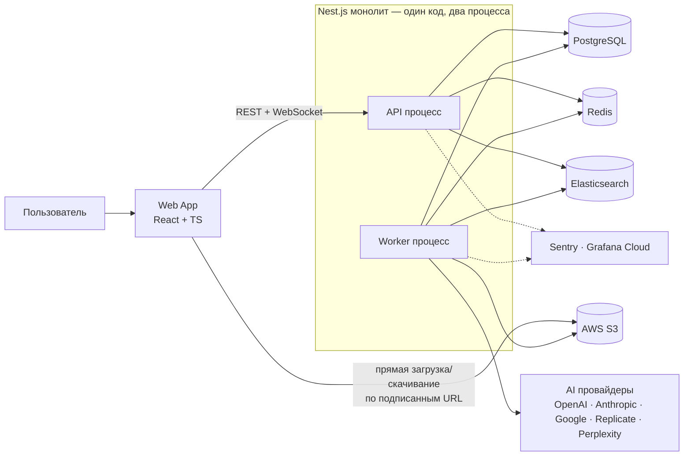
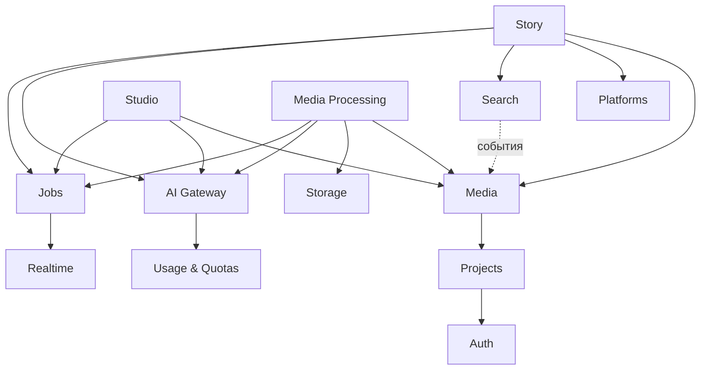
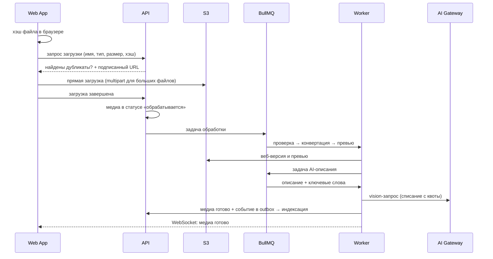
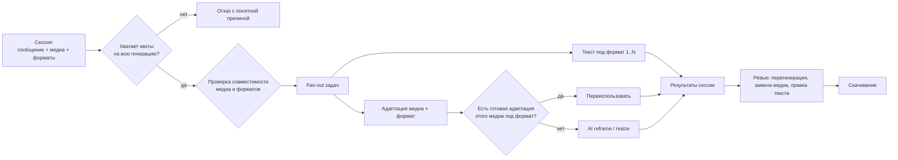

# Factive Boosted — Architecture

> Статус: **черновик v0.2**.
> Уровень: system design — модули, потоки, хранилища, ключевые решения. Без схем БД и кода.
> Что и зачем строим — см. [PROJECT_BRIEF.md](PROJECT_BRIEF.md).

---

## 1. Функциональная карта (что должно работать в итоге)

`factive_reference/` используется только как перечень возможностей, не как образец реализации.

### Аккаунт и проекты
- Регистрация и вход по email + паролю.
- Выход, выход со всех устройств.
- Пользователь создаёт свои проекты ACTIV8, переименовывает, деактивирует/активирует.
- Проект видит и изменяет только его владелец.

### Media Pool
- Загрузка изображений и видео, в том числе пакетная; предупреждение о дубликатах до загрузки.
- Конвертация в веб-форматы с сохранением оригинала, генерация превью.
- AI-описание каждого медиа + извлечение ключевых слов с весами (для поиска и подбора).
- Теги (ручные), реакции (like/dislike), флаг «права третьих лиц».
- Ручное удаление: медиа 7 дней лежит в архиве и его можно восстановить, после этого оно удаляется навсегда.
- Поиск и фильтры: текст, исключающий запрос, тип медиа, теги, реакция; отдельный просмотр архива.
- Просмотр, скачивание оригинала и веб-версии.
- Группы вариантов (оригинал + производные из Studio) — **детали обсуждаем на этапе реализации**.

### AI Studio
Полный список возможностей reference ниже; для нас он будет меньше и проще — состав определяем при реализации.

- Операции над изображениями: создать, изменить, добавить объект, пересоздать, вырезать (cutout), сменить соотношение сторон, генерация по референсам.
- Операции над видео: анимировать изображение, сменить соотношение сторон (reframe), генерация по референсам.
- Источник: медиа из пула, загруженный файл или ранее сохранённый результат.
- Результаты → «избранное» студии → сохранение в пул.

### Story
- Сессия: текст сообщения (пишет пользователь) + набор медиа (из пула, из AI-подбора по тексту, из избранного студии, загруженные в сессии).
- Выбор целевых форматов из каталога площадок: Meta, LinkedIn, YouTube, баннеры, long-form, прочие.
- Для каждого формата: AI-текст под площадку + адаптация каждого медиа под размеры/пропорции формата.
- Переиспользование уже адаптированных медиа (одно и то же медиа под тот же формат не генерируется дважды).
- Ревью: перегенерировать, заменить медиа, править текст, скачать результат.
- История сессий.

### Вне скоупа
Роли и админка, компании, одноразовые коды, email и сброс пароля, внешняя загрузка, Messages, экспорт Story, а также Scout, Genie, ID8, Sonar, Resonance, AI Playground.

---

## 2. Архитектурные драйверы

| Драйвер | Следствие для архитектуры |
|---|---|
| AI-операции длятся от секунд до минут | Всё тяжёлое — асинхронные задачи в очереди; HTTP только ставит задачу и отдаёт статус |
| Большие медиафайлы (до гигабайт видео) | Файлы идут напрямую клиент ↔ S3, API никогда не проксирует байты |
| Открытая регистрация без подтверждения почты | Квоты и rate limiting — единственная защита от сжигания AI-бюджета |
| Данные разных пользователей в одной системе | Проверка владения на каждом запросе, централизованно |
| Много AI-провайдеров, модели быстро устаревают | Единый AI-шлюз, провайдеры — сменные адаптеры, выбор модели — конфигурация |
| Надёжность | Задачи переживают рестарт, есть ретраи, идемпотентность, видимые ошибки |
| Один разработчик | Модульный монолит, минимум инфраструктуры, максимум автоматизации |

---

## 3. Контекст системы

**Монолит, но два процесса.** Одна кодовая база, одна сборка, один деплой-артефакт. Запускается в двух ролях:
- **API** — HTTP, WebSocket, авторизация, проверка квот, постановка задач. Должен отвечать быстро.
- **Worker** — обработчики очередей BullMQ и плановые задачи: ffmpeg, AI, индексация.

Так тяжёлая обработка видео не блокирует API, и роли масштабируются независимо, не превращаясь в микросервисы.

---

## 4. Модули бэкенда

Каждый модуль — отдельный Nest-модуль со своими таблицами и публичным интерфейсом. Модули не читают чужие таблицы напрямую; общаются через публичные сервисы или доменные события.

| Модуль | Ответственность |
|---|---|
| **Auth** | Регистрация, вход, пароли, токены и сессии, проверка владения ресурсами |
| **Projects** | Проекты пользователя, активность, настройки проекта (язык, бренд, промпты) |
| **Storage** | Работа с S3: подписанные URL, структура хранения, жизненный цикл файлов |
| **Media** | Медиа пула: метаданные, теги, реакции, флаги, архив и окончательное удаление |
| **Media Processing** | Пайплайн после загрузки: проверка, конвертация (ffmpeg), превью, запуск AI-описания |
| **Search** | Индексация в Elasticsearch, поиск по пулу, AI-подбор медиа по тексту |
| **AI Gateway** | Единый интерфейс к AI-провайдерам, маршрутизация моделей, промпты |
| **Usage & Quotas** | Учёт расходов на AI, квоты пользователя, резервирование перед запуском |
| **Studio** | Операции AI Studio, результаты, избранное, сохранение в пул |
| **Platforms** | Каталог площадок и форматов (размеры, пропорции, тип медиа, требования к тексту) |
| **Story** | Сессии, генерация под форматы, ревью, скачивание |
| **Jobs** | Инфраструктура очередей: регистрация задач, статусы, ретраи, наблюдаемость |
| **Realtime** | Доставка событий в браузер (готовность задач, прогресс) |

Направление зависимостей — сверху вниз. Фичи (Story, Studio) опираются на ядро (Media, AI Gateway, Storage), но не наоборот. Ни один AI-вызов не проходит мимо Usage & Quotas.

---

## 5. Хранилища — кто за что отвечает

| Хранилище | Роль | Правило |
|---|---|---|
| **PostgreSQL** (Prisma) | Единственный источник правды: пользователи, сессии, проекты, медиа, теги, результаты студии, Story, задачи, учёт расходов и квоты | Всё, что нельзя потерять, живёт здесь |
| **Elasticsearch** | Поисковый индекс медиа (описания, ключевые слова с весами, теги, фильтры) | Производные данные; индекс можно полностью пересобрать из PostgreSQL |
| **AWS S3** | Оригиналы, веб-версии, превью, результаты генерации, временные загрузки | Бакет приватный, доступ только по подписанным URL; временные файлы удаляются политикой жизненного цикла |
| **Redis** | Очереди BullMQ, кэш, rate limiting, pub/sub для WebSocket между инстансами | Ничего, что нельзя восстановить |

**Синхронизация PostgreSQL → Elasticsearch** — паттерн outbox: изменение медиа и запись события сохраняются в одной транзакции, отдельная задача переносит событие в индекс. Индекс не может навсегда отстать или разойтись с БД.

Сейчас все хранилища, кроме S3, работают локально в docker compose. При появлении деплоя целевой вариант для поиска — Elastic Cloud, CDN — CloudFront.

---

## 6. Ключевые потоки

### 6.1 Загрузка медиа в пул

Отличия от reference: дубликаты по хэшу содержимого (а не «тип + размер»), API не принимает файл, каждый шаг — отдельная повторяемая задача, статус обработки виден пользователю.

«Обрабатывается / готово / ошибка» — это технический статус обработки, а не жизненный цикл медиа. Бизнес-состояние у медиа одно — «в архиве» после ручного удаления (см. 6.5).

### 6.2 Операция AI Studio

1. Пользователь выбирает источник и операцию → API проверяет владение, параметры и квоту, резервирует стоимость, создаёт запись операции, ставит задачу и сразу отвечает её идентификатором.
2. Worker готовит входные файлы и вызывает AI Gateway. Долгие генерации у провайдера (видео) не держат воркер: задача периодически переставляется с задержкой для проверки статуса.
3. Результат → S3 → запись результата студии → списание фактической стоимости → событие в браузер.
4. Пользователь сохраняет результат в избранное или в пул (дальше обычный пайплайн обработки из 6.1).
5. Сбой: резерв квоты возвращается, статус «ошибка» с понятным сообщением, событие в Sentry.

### 6.3 Генерация Story

- Квота проверяется до старта на оценочную стоимость всей генерации, а не посреди процесса.
- Каждая пара «медиа × формат» и каждый текст — отдельная задача: частичный сбой не валит всю сессию, упавшее можно перезапустить точечно.
- Кэш адаптаций хранится в PostgreSQL и не теряется при рестарте. Переиспользование не тратит квоту.

### 6.4 Поиск и AI-подбор медиа

- Поиск по пулу: полнотекстовый запрос по описаниям и тегам + фильтры + исключающий запрос, всегда в границах проекта текущего пользователя.
- AI-подбор для Story: текст сообщения → ключевые слова → поиск с учётом весов ключевых слов, добор по обычному совпадению.
- Следующий шаг (не MVP): семантический поиск через векторы (эмбеддинги описаний, kNN в Elasticsearch) поверх текущего подхода.

### 6.5 Удаление медиа

- Медиа и его файлы (оригинал, веб-версия, превью) хранятся, пока пользователь сам их не удалит.
- **Ручное удаление:** медиа уходит в архив — пропадает из поиска, фильтров и AI-подбора для Story. Из архива его можно восстановить в течение 7 дней.
- **Окончательное удаление** выполняет плановая задача: файлы в S3, запись в PostgreSQL и документ в индексе удаляются вместе. Задача идемпотентна — повторный запуск после сбоя дочищает то, что осталось.
- В интерфейсе видно, сколько дней осталось до окончательного удаления.
- **Производные не удаляются.** Результаты AI Studio и адаптации Story, сделанные из медиа, — самостоятельный контент со своими файлами. При удалении исходника они остаются, а ссылка на источник помечается «источник удалён». Поэтому производный контент не может зависеть от файлов исходника — только от своих.

---

## 7. Фоновые задачи (BullMQ)

| Очередь | Задачи | Особенности |
|---|---|---|
| `media-processing` | проверка, конвертация, превью | ffmpeg; низкая параллельность для видео |
| `ai-describe` | описание и ключевые слова | лимиты под провайдера |
| `ai-generate` | операции Studio, адаптации и тексты Story | долгие операции через отложенные проверки статуса |
| `search-index` | перенос событий outbox в индекс, переиндексация | идемпотентно |
| `scheduled` | окончательное удаление медиа из архива старше 7 дней, очистка временных файлов, сверка индекса, сброс периодов квот | повторяющиеся задачи BullMQ |

Общие правила:
- Каждая задача **идемпотентна** — повтор не создаёт дублей и не списывает квоту дважды.
- Ретраи с экспоненциальной задержкой, лимит попыток, окончательные сбои сохраняются и видны.
- Задача несёт correlation id запроса, который её породил, — сквозной след в логах и Sentry.
- Пользовательский статус задачи хранится в PostgreSQL, а не только в Redis.
- Отмена поддерживается там, где имеет смысл (Studio, Story), с возвратом резерва квоты.
- Параллельность ограничивается по провайдеру (его rate limits) и по пользователю (чтобы один пользователь не занял всю очередь).

### Видео: ffmpeg vs AWS MediaConvert

MediaConvert на базовом тарифе стоит порядка $0.0075 за минуту выходного видео в SD и $0.015 в HD. Для нашего объёма это копейки, так что вопрос не в цене, а в сложности: отдельный асинхронный сервис, IAM-роли, опрос статуса или события.

**Решение:** ffmpeg в Worker. Конвертация спрятана за внутренним интерфейсом, поэтому если видео станет много или оно станет тяжёлым, MediaConvert подключается как ещё одна реализация без изменений в остальном коде.

---

## 8. AI Gateway

- **Интерфейс по возможностям, а не по провайдерам:** текст, анализ изображения/видео, генерация и редактирование изображения, генерация видео, reframe видео.
- **Адаптеры провайдеров:** OpenAI, Anthropic, Google, Replicate, Perplexity. Новый провайдер = новый адаптер, остальной код не меняется.
- **Маршрутизация — конфигурация:** какая модель выполняет какую операцию, с каким fallback. Смена модели не требует правок в Studio/Story.
- **Промпты — версионируемые шаблоны** с параметрами проекта (язык, бренд, категория). В reference промпт описаний жёстко привязан к одному клиенту и языку — здесь это настройки проекта.
- **Устойчивость:** таймауты, ретраи только для временных ошибок, circuit breaker при деградации провайдера.

---

## 9. Квоты и учёт расходов

- **Единица учёта — кредиты.** У каждой операции есть цена в кредитах (из конфигурации), которая отражает реальную стоимость у провайдера. Пользователь видит кредиты, а не доллары конкретного провайдера.
- **Квота на пользователя за период** (например, месяц) + лимит одновременных задач.
- **Резервирование:** перед постановкой задачи API атомарно резервирует оценочную стоимость. Не хватает — запрос отклоняется сразу с понятной причиной.
- **Списание по факту:** после завершения резерв заменяется фактической стоимостью; при сбое или отмене резерв возвращается.
- **Журнал расходов** в PostgreSQL: каждый вызов с моделью, длительностью, результатом, стоимостью у провайдера и списанными кредитами. Это же — источник метрик расходов.
- **Видимость:** пользователь видит остаток и историю расходов в интерфейсе.
- Размеры квот по умолчанию задаются конфигурацией. Индивидуальная квота в MVP меняется вручную в БД.

---

## 10. Аутентификация и доступ

**Аутентификация**
- Регистрация и вход: email + пароль. Пароли — медленный хэш (argon2).
- Access token — короткоживущий JWT, хранится в памяти приложения, не в localStorage.
- Refresh token — в httpOnly Secure cookie, ротация при каждом использовании, обнаружение повторного использования (отзыв всей цепочки).
- Серверные сессии: выход со всех устройств, отзыв при смене пароля.
- Rate limiting на регистрацию и вход (по IP и по email). Без подтверждения почты это главная защита от массовой регистрации, вместе с квотами.
- Сброса пароля в MVP нет: email-провайдер не подключаем.

**Доступ**
- Одна роль. Авторизация = **владение**: пользователь → его проекты → всё внутри проекта.
- Проверка владения централизована (guard + политика доступа), а не разбросана по контроллерам. По умолчанию всё закрыто.
- На чужой ресурс отвечаем «не найдено», а не «запрещено», чтобы не раскрывать, что он существует.
- Деактивированный проект доступен только на чтение.

**Прочее**
- Секреты — в `.env`, который не коммитится; в репозитории только шаблон без значений. При появлении деплоя — AWS Secrets Manager.
- Медиа не публичны: доступ по подписанным URL с коротким сроком.
- Валидация входных данных на границе API, проверка реального типа файла, лимиты размера.
- CORS только для своих доменов, security-заголовки.

---

## 11. Realtime

- WebSocket-шлюз Nest (Socket.IO) с Redis-адаптером — работает при нескольких инстансах API.
- Подключение авторизуется тем же access token; клиент получает события только своих проектов.
- События: медиа обработано, прогресс/результат задачи, обновление Story-сессии, изменение остатка квоты.
- Событие на клиенте = инвалидация соответствующих данных в RTK Query, а не ручное обновление состояния.

---

## 12. API

- REST, версия в пути, единый формат ошибок, курсорная пагинация.
- OpenAPI генерируется из Nest; из него же генерируются эндпоинты и типы RTK Query для фронта — фронт и бэк не расходятся по контрактам.
- Долгие операции: `202 Accepted` + идентификатор задачи; статус через API и WebSocket.
- Idempotency key для операций, запускающих платную генерацию (защита от двойного клика и повторов).
- Нехватка квоты — отдельный понятный тип ошибки, который фронт показывает пользователю.

---

## 13. Фронтенд

**Стек:** React + TypeScript, Vite, FSD, MUI.
**Состояние:** Redux Toolkit. Серверные данные — через RTK Query (часть Redux Toolkit): кэш, инвалидация по тегам, статусы загрузки. В слайсах — только клиентское состояние (выбранные медиа, фильтры, состояние конструктора Story). Никаких «толстых» редьюсеров, дублирующих данные с сервера.
**Формы:** React Final Form + Yup.

**FSD-раскладка ACTIV8 (ориентир):**

| Слой | Примеры |
|---|---|
| `app` | провайдеры, store, роутинг, авторизационная обвязка, тема MUI, обработка ошибок, Sentry |
| `pages` | регистрация, вход, список проектов, проект → Find / Studio / Story, квоты и расходы |
| `widgets` | сетка медиа, панель фильтров, рабочая область студии, конструктор Story, выбор площадок, история сессий |
| `features` | загрузить медиа, тегировать, реагировать, удалить/восстановить, запустить операцию студии, сохранить в пул, сгенерировать Story, скачать |
| `entities` | user, project, media, tag, platform, studio-result, story-session, job, quota |
| `shared` | базовый API (RTK Query), UI-примитивы поверх MUI, утилиты, i18n, конфиг |

Правила: импорты только сверху вниз по слоям, публичный API у каждого слайса, никакой бизнес-логики в `shared`. Эндпоинты RTK Query лежат в сущностях/фичах, к которым относятся, а не одним файлом.

---

## 14. Наблюдаемость

- **Логи:** структурированный JSON, correlation id сквозь HTTP → задачи → вызовы AI; без персональных данных и секретов.
- **Ошибки:** Sentry на фронте и бэке, релизы и source maps, связь с correlation id.
- **Метрики** (в формате Prometheus):
  - HTTP: частота, ошибки, латентность по маршрутам;
  - очереди: глубина, время ожидания, длительность, сбои по каждой очереди;
  - AI: латентность, ошибки и стоимость по провайдеру и модели;
  - квоты: расход кредитов, отказы по квоте;
  - бизнес: регистрации, загрузки, операции студии, Story-генерации.
- **Grafana Cloud (бесплатный тариф):** агент Grafana Alloy в docker compose собирает метрики и логи и отправляет их в Grafana Cloud. Там дашборды по группам выше и алерты (рост ошибок, застрявшие очереди, всплеск расходов AI).
- Бесплатный тариф ограничен по объёму, поэтому метки у метрик держим с низкой кардинальностью (без id пользователей и медиа), а логи — без лишнего шума.
- Health/readiness-эндпоинты для API и Worker.

---

## 15. Тестирование

| Уровень | Инструменты | Что покрываем |
|---|---|---|
| Unit (фронт) | Vitest + React Testing Library + MSW | features, widgets, формы, слайсы |
| Unit (бэк) | Vitest | доменная логика, политика владения, квоты, маршрутизация AI |
| Интеграционные (бэк) | Testcontainers: Postgres, Redis, Elasticsearch | модули с настоящими зависимостями, очереди, индексация, резервирование квот, окончательное удаление |
| Контрактные | фейковые адаптеры AI-провайдеров | поведение без реальных платных вызовов |
| E2E | Playwright | критичные сценарии: регистрация, загрузка, операция студии, Story |

CI не пропускает изменения без линта, проверки типов и тестов.

---

## 16. Инфраструктура и CI

- **Только локально.** Staging и production пока нет.
- **docker compose:** Postgres, Redis, Elasticsearch, агент Grafana Alloy. API и Worker запускаются локально (ffmpeg — локально или в образе Worker).
- **Внешние сервисы:** AWS S3 (реальный бакет), AI-провайдеры, Sentry, Grafana Cloud.
- **Тестовые данные в S3** — отдельный префикс или бакет, чтобы тесты не трогали рабочие файлы.
- **CI (GitHub Actions):** линт → проверка типов → тесты (включая интеграционные на Testcontainers) → проверка сборки. Ничего не деплоит.
- Миграции БД через Prisma, применяются локально командой.
- Когда появится деплой, отдельно спроектируем окружения и AWS-инфраструктуру.

---

## 17. Что делаем иначе, чем в Factive

| Factive | Factive Boosted |
|---|---|
| Elasticsearch как единственная БД | PostgreSQL — правда, Elasticsearch — только индекс |
| Файлы на диске сервера, часть — публично | Приватный S3, подписанные URL |
| Файлы идут через API | Прямая загрузка в S3 |
| Задачи в памяти процесса, теряются при рестарте | BullMQ: ретраи, идемпотентность, статусы, отдельный Worker |
| Операции Studio синхронно в HTTP-запросе | Асинхронные задачи + события в браузер |
| Кэш адаптаций Story в памяти | Всё в PostgreSQL |
| Дубликаты по «тип + размер» | Дубликаты по хэшу содержимого |
| Промпт жёстко под одного клиента и язык | Шаблоны промптов + настройки проекта |
| Модели зашиты в операции | Маршрутизация моделей — конфигурация AI Gateway |
| Расходы на AI никак не ограничены | Кредиты, квоты, резервирование, журнал расходов |
| Сложная модель ролей, почти не проверяемая | Одна роль, строгая проверка владения на каждом запросе |
| Токены без продуманного хранения и отзыва | Access в памяти, refresh в httpOnly cookie с ротацией, отзыв сессий |
| Нет мониторинга, 2 теста | Sentry, Grafana Cloud, тестовая пирамида в CI |
| JS, огромные Redux-редьюсеры | TypeScript, FSD, Redux Toolkit + RTK Query |
| Секреты в репозитории | Секреты вне репозитория |

---

## 18. Порядок реализации

Вертикальными срезами: каждый этап даёт работающий функционал end-to-end, с тестами и метриками.

1. **Фундамент** — репозиторий, CI, docker compose, каркас API/Worker, логи, Sentry, метрики, каркас фронта на FSD с MUI и Redux Toolkit.
2. **Auth + Projects** — регистрация, вход, токены и сессии, проверка владения, CRUD проектов.
3. **Media Pool** — загрузка в S3, дубликаты, пайплайн обработки (ffmpeg, превью), теги, реакции, флаги, архив и окончательное удаление.
4. **AI Gateway + Usage & Quotas** — первые провайдеры, маршрутизация, кредиты и резервирование; AI-описания медиа.
5. **Search** — индексация через outbox, поиск и фильтры в пуле.
6. **Studio** — упрощённый набор операций (состав определяем при реализации), избранное, сохранение в пул; обсуждение групп вариантов.
7. **Story** — каталог площадок, сессии, AI-подбор медиа, fan-out генерации, ревью, скачивание.

---

## 19. Открытые вопросы

1. **Деактивация проекта.** Только чтение и скрыт из списка — так?
2. **Загрузка в Story.** Файлы, загруженные прямо в сессии, остаются только в сессии или сразу попадают в пул?
3. **Группы вариантов** — обсуждаем на этапе Studio.
4. **Секреты** — решение по хранению при появлении деплоя.
